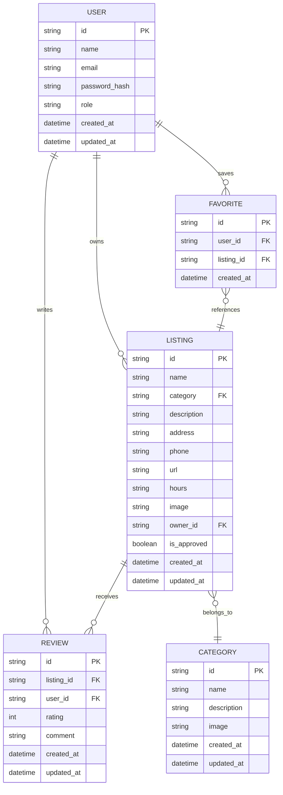
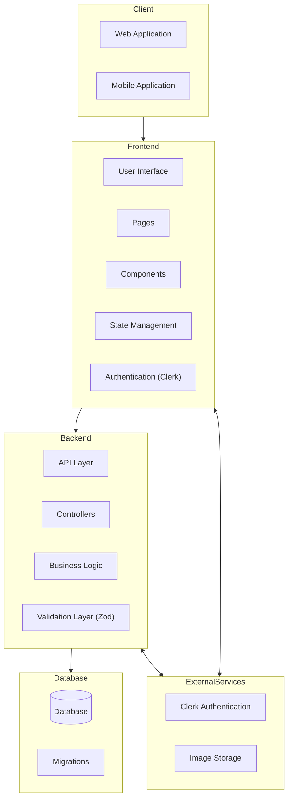
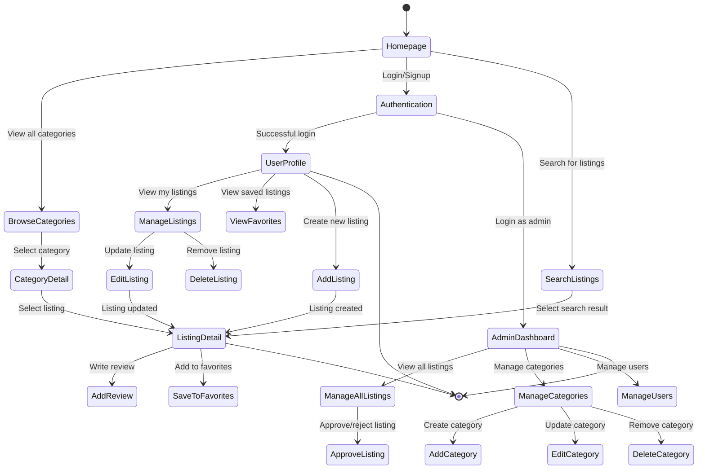
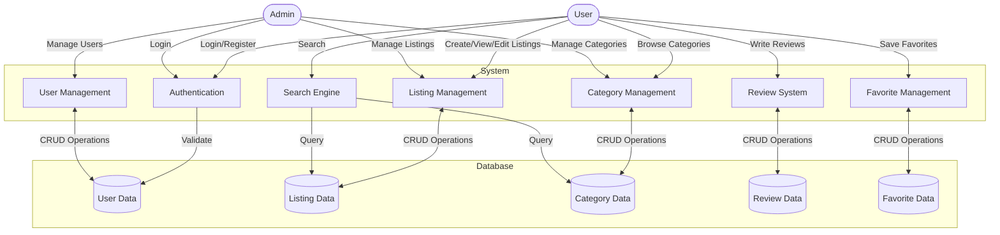
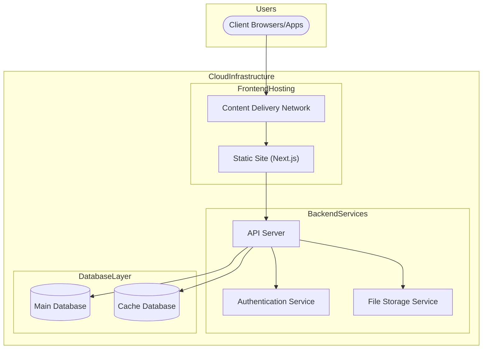

**Frontend**

[x] Navbar dropdown menu
[x] categories page
[x] categories/name page
[x] list_detail page
[x] add listing form
[x] zod validation
[x] admin page
[x] auth
[x] update hero section
[x] add the list table on admin page & profile page
[x] Show all listings in admin page
[x] Show all user in admin page
[x] integrate with tanstack query
[] toast

**Backend**

[x] Database migration
[x] setup database
[x] api CRUD
[x] integration with clerk
[x] api for add listing and edit
[x] API for user

**Design**
[] Database Design
[] System Design

## Database Design

## System Architecture

## User Flow Diagram

## Data Flow Diagram

## Deployment Architecture

